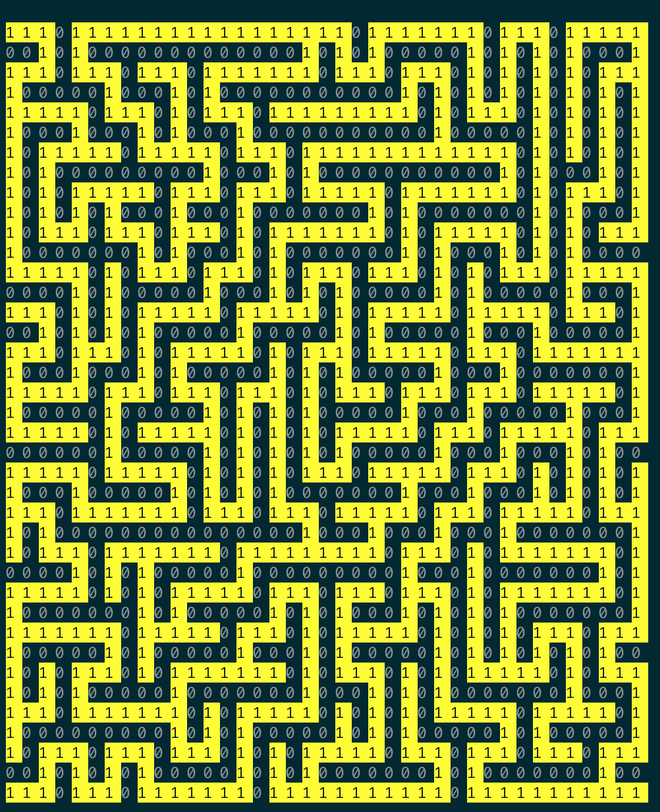

# Lava Maze

*Maze game using Azure functions*

To generate a maze

```
C:\Users\Linan Qiu>curl "https://linansmaze.azurewebsites.net/api/GenerateMaze"
{"Id":"4b4fb2f3-b208-4ea2-a0f9-98f0f81ac5ea","Width":59,"Height":59}
```

This tells you the `Id` of the maze (`4b4fb2f3-b208-4ea2-a0f9-98f0f81ac5ea`) and the `(Width, Height)` of the maze `(59, 59)`.



You start at `(0, 0)` and should find a path (as a series of `NSEW` instructions) that navigates to `(Width - 1, Height - 1)` (e.g. `(58, 58)`) since we zero index.

However, you can only check one cell at a time if the cell is land (you can walk on it) or lava (you can't walk on it).

```
C:\Users\Linan Qiu>curl "https://linansmaze.azurewebsites.net/api/GetCell/4b4fb2f3-b208-4ea2-a0f9-98f0f81ac5ea?x=0&y=0"
{"X":0,"Y":0,"IsLand":true}
C:\Users\Linan Qiu>curl "https://linansmaze.azurewebsites.net/api/GetCell/4b4fb2f3-b208-4ea2-a0f9-98f0f81ac5ea?x=58&y=58"
{"X":58,"Y":58,"IsLand":true}
C:\Users\Linan Qiu>curl "https://linansmaze.azurewebsites.net/api/GetCell/4b4fb2f3-b208-4ea2-a0f9-98f0f81ac5ea?x=4&y=2"
{"X":4,"Y":2,"IsLand":true}
C:\Users\Linan Qiu>curl "https://linansmaze.azurewebsites.net/api/GetCell/4b4fb2f3-b208-4ea2-a0f9-98f0f81ac5ea?x=4&y=1"
{"X":4,"Y":1,"IsLand":false}
C:\Users\Linan Qiu>curl "https://linansmaze.azurewebsites.net/api/GetCell/4b4fb2f3-b208-4ea2-a0f9-98f0f81ac5ea?x=4&y=0"
{"X":4,"Y":0,"IsLand":true}
C:\Users\Linan Qiu>curl "https://linansmaze.azurewebsites.net/api/GetCell/4b4fb2f3-b208-4ea2-a0f9-98f0f81ac5ea?x=5&y=0"
{"X":5,"Y":0,"IsLand":true}
C:\Users\Linan Qiu>curl "https://linansmaze.azurewebsites.net/api/GetCell/4b4fb2f3-b208-4ea2-a0f9-98f0f81ac5ea?x=5&y=1"
{"X":5,"Y":1,"IsLand":false}
```

This tells you that `(0, 0)` is land (which is guaranteed because you start there). `(58, 58)` is land as well because you want to get there. `(4, 1)` is lava so you can't walk there.

To solve the maze,

```
C:\Users\Linan Qiu>curl "https://linansmaze.azurewebsites.net/api/SolveMaze/4b4fb2f3-b208-4ea2-a0f9-98f0f81ac5ea?steps=NNNNNNNNNEEEEEEEEEEEEESSSSWWWW"
{"Solved":false,"Message":"Last step ran into a wall. LastX=0, LastY=1, StepsTaken=N, StepsSubmitted=NNNNNNNNNEEEEEEEEEEEEESSSSWWWW"}
```

I'm kind enough to give you some reason for your failure (don't we always at Bridgewater hehe). When you do solve the maze, you will get a password like this: 

```
{"Solved":false,"Message":"password"}
```

Happy solving!
